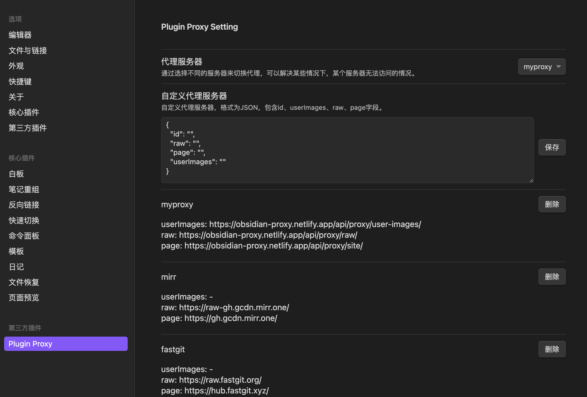

# obsidian-plugin-proxy

本插件基于 [binyu1231/obsidian-plugin-proxy](https://github.com/binyu1231/obsidian-plugin-proxy) 的master分支进行开发。

它是一个代理工具，可以帮助您更快地访问插件市场。

## 开始

1、在下面的链接下载 `obsidian-plugin-proxy.zip` 文件。  
- [Github下载地址](https://github.com/gslnzfq/obsidian-plugin-proxy/releases)

2、解压 `obsidian-plugin-proxy.zip` 到你笔记的 `.obsidian/plugins` 文件夹

## 自定义配置

配置  `.obsidian/plugins/obsidian-plugin-proxy/data.json` 文件中 `proxyList` 字段

``` json
{
  // ...
  "proxyList": [
    // ... other proxy
    {
      "id": "your proxy id",
      "raw": "https://gh.gcdn.mirr.one/",
      "userImages": "https://raw-gh.gcdn.mirr.one/",
      "page": "https://gh.gcdn.mirr.one/"
    }
  ]
  // ...
}
```

## 界面配置

需要搭配可以查看[代理服务器中的配置链接](https://obsidian-proxy.netlify.app/)使用。

- 关联项目：[obsidian-proxy-server](https://github.com/gslnzfq/obsidian-proxy-server)

设置页面的配置，可以添加和删除代理，可以切换代理



## License

[MIT](./LICENSE) License © 2022 [binyu1231](https://github.com/binyu1231)
